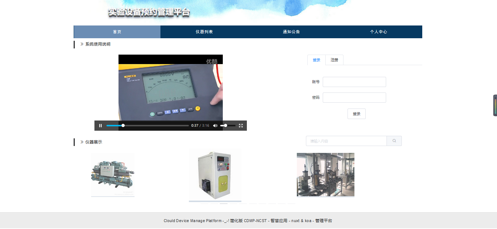
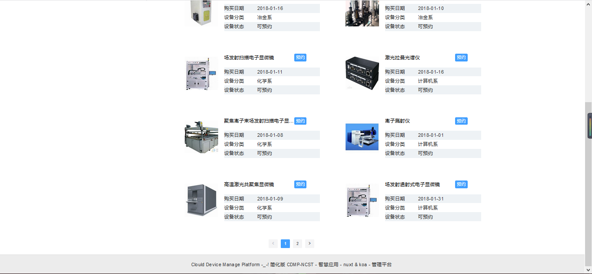
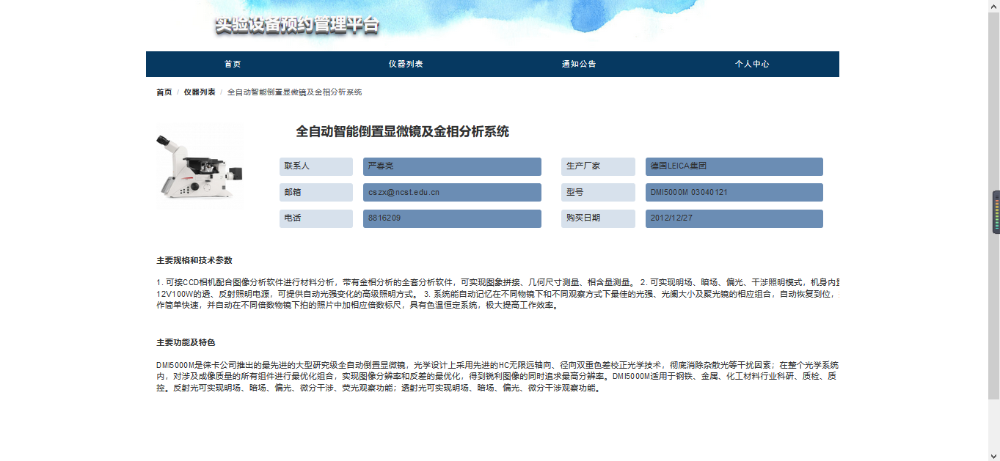
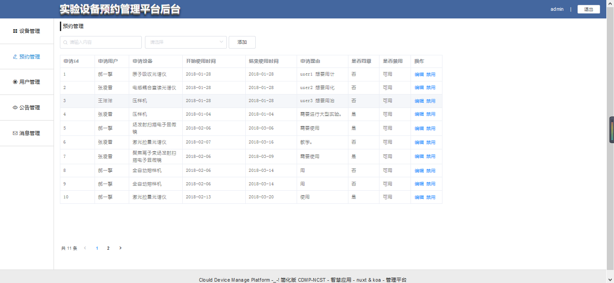
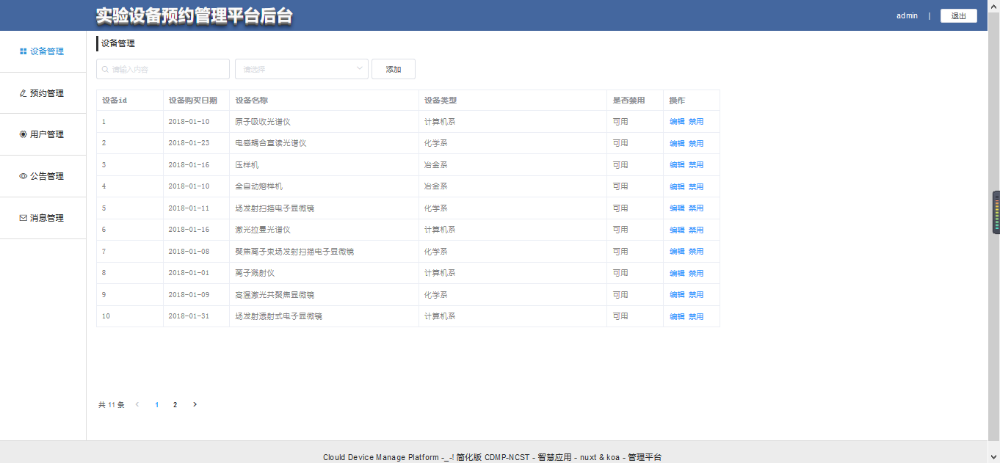

# nuxt-cdmp(实验设备预约平台)

> Node.js(v9.4.0) + koa(2.4.1) + vue(2.5) + vuex + sequelize(4.32.2)+ element-ui(2.1.0) + （NUXT）SSR
## 前言 

本项目纯属个人框架学习阶段练习所用，数据并非真实。

github: https://github.com/CodeTeamOfNcst/CDMP-

本平台仿照[现有平台](http://fxcszx.ncst.edu.cn/)进行技术重构，仍在开发阶段，今后会持续进行功能扩充和完善，目前仅完成了部分功能。

项目持续进行中~

为什么选用 NUXT 

优点1：就是我们无需为了路由划分而烦恼，你只需要按照对应的文件夹层级创建 .vue 文件就行

优点2：无需考虑数据传输问题，nuxt 会在模板输出之前异步请求数据（需要引入 axios 库），而且对 vuex 有进一步的封装

优点3：内置了 webpack，省去了配置 webpack 的步骤，nuxt 会根据配置打包对应的文件，方便使用各种模板语言

重点4：nuxt集成了前后端，采用vue编写前台页面，koa编写后台页面（虽然使用koa踩了一个不小的坑。。），ES6编写异步代码，使得逻辑更加清晰。项目使用了较新的ES标准，所以要求于运行node版本在9.0以上。

## 项目截图 

1.首页

2.设备列表

3.设备详情

4.预约管理

5设备管理

## 部署 

阿里云 ECS 服务器 ubuntu 16.04，[访问这里](http://120.77.87.244)

0、安装node 9.0以上版本

​	（1）首先安装 nvm 

​		linux（ubuntu）下：

​			sudo apt-get install git     

​			curl -o- https://raw.githubusercontent.com/creationix/nvm/v0.33.1/install.sh | bash

​		windows（10）下:

​			首先安装chocolaty，cmd(管理员模式下)

​			@"%SystemRoot%\System32\WindowsPowerShell\v1.0\powershell.exe" -NoProfile -InputFormat None -ExecutionPolicy Bypass -Command "iex ((New-Object System.Net.WebClient).DownloadString('https://chocolatey.org/install.ps1'))" && SET "PATH=%PATH%;%ALLUSERSPROFILE%\chocolatey\bin"

​			然后使用 chocolatey 安装  nvm

​			choco install nvm

​		(2)使用nvm安装 node 9.4.0

​			nvm install node v9.4.0

1、安装yarn（方便node包的兼容安装）

​		(1) linux 下

​			curl -sS https://dl.yarnpkg.com/debian/pubkey.gpg | sudo apt-key add -echo "deb https://dl.yarnpkg.com/debian/ stable main" | sudo tee /etc/apt/sources.list.d/yarn.list

​			sudo apt-get update && sudo apt-get install yarn

​		（2）windows（10） 下

​			 choco install yarn

2、bash 下进入到项目文件夹内

​		cd CDMP

3、yarn install（npm install由于兼容性的问题，可能会报错）

4、配置数据库配置文件（使用mysql 数据库，linux 和 windows 稍有不同，默认已经安装完成[mysql数据库](https://www.mysql.com/downloads/)）

​		找到项目文件夹下的数据文件 cdmp.sql 利用navicat 新建本地数据库

​		(1)linux 下， 由于 sequelize 的创建数据库的小bug（也可能是我文档没读完整），创建的数据库table名称与定义名称在大小写方面并不相同，所以需要关闭linux下mysql数据库的大小写识别，方式如下

​			nano 	/etc/mysql/mysql.conf.d/mysqld.cnf

​			\#修改数据库大小写识别，增加一行输入：

​			lower_case_table_names=1

​			\#保存退出	

​			ctrl + c（nano）或 wq（vim）

​		(2)windows10下 mysql默认不区分数据库table名称大小写 ，可不做修改，直接导入数据文件

​	        (3)修改数据库配置

​			修改项目文

件夹下的 /server/dbconfig/dbconfig 中，根据注释修改数据库host，用户名和密码等

5、开发环境测试

​		项目文件夹下运行

​			yarn install && yarn run dev

6、部署环境（项目部署仍属于[测试阶段](http://chrisprosise.top/)，不能保证随时可以访问）

​		(1)安装 pm2

​			yarn install pm2

​		(2)创建 build 代码

​			yarn run build  ( 这里如果计算机内存小于1G则会build失败 -_- ! )

​		(3)pm2 运行项目

​			pm2 start build/mian.js

7、查看 pm2 list 列表，查看启动状态

8、pm2 monit  监视所有进程

9、开启 nginx 转发

​	 这里 由于项目中使用的axios 在服务端和客户端都有用到，所以请求头header的设置需要根据nginx 的跨域访问请求进行设置，在这里不多赘述。

## 测试

1. 单元测试

   单元测试由 node 下测试模块 jasmine编写，需要在服务启动的状态下运行。首先全局安装jasmine

   ​	yarn global add jasmine

   运行测试

   ​	yarn run test

## 功能完成情况 

1. 设备搜索
2. 公告的编辑查看
3. 登陆注册功能
4. 管理员对设备信息的管理
5. 管理员对预约信息的管理
6. 调用api查询设备信息
7. 上传设备图片
8. 首页添加操作指南视频
9. 用户对设备进行预约
10. 用户查看历史预约信息

## 技术难点
1. koa处理文件上传逻辑，创建临时存储
2. 文件流转化视频流解析播放
3. vuex（用于存储从nuxt处理过的req中提取的cookie，此处和官网有出入）
4. Vue（相当好的一个框架）

## 团队 

如果你觉得此项目对你有帮助，不妨留个 star (! ^_^ !)

## 
